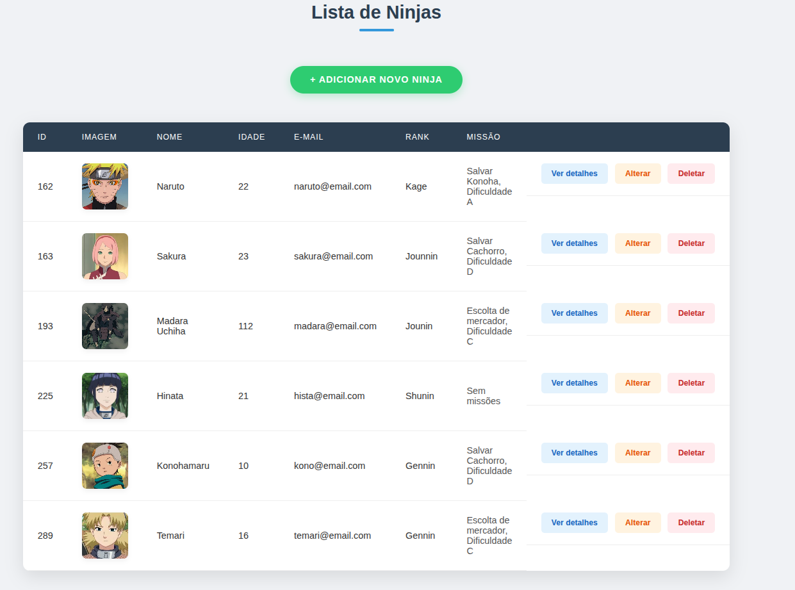
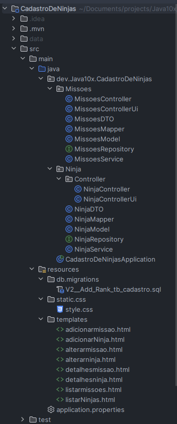

# 🥷 Cadastro de Ninjas - Spring Boot Full-Stack


Este projeto é uma aplicação **Full-Stack** desenvolvida para o gerenciamento de Ninjas e suas respectivas Missões. O objetivo principal foi aplicar conceitos avançados do ecossistema **Spring**, como persistência de dados, mapeamento de relacionamentos, versionamento de banco de dados e renderização no lado do servidor (SSR).



## 🚀 Funcionalidades

- **CRUD Completo de Ninjas:** Cadastro, listagem, edição e exclusão.
- **Gerenciamento de Missões:** Vínculo dinâmico entre Ninjas e Missões (Relacionamento `@ManyToOne`).
- **Interface Responsiva:** UI desenvolvida com Thymeleaf e CSS3 personalizado.
- **Versionamento de Banco:** Evolução do esquema de dados controlada pelo **Flyway Migrations**.
- **Segurança e Organização:** Uso de DTOs e Mappers para isolar as entidades da camada de visualização.

## 🛠️ Tecnologias Utilizadas

- **Linguagem:** Java 17+
- **Framework:** Spring Boot 3.x
- **Persistência:** Spring Data JPA / Hibernate
- **Banco de Dados:** H2 (Desenvolvimento) / MySQL (Produção)
- **Migrações:** Flyway
- **Template Engine:** Thymeleaf
- **Ferramenta de Build:** Maven
- **SO de Desenvolvimento:** Ubuntu Linux


## 📂 Estrutura do Projeto

O projeto segue uma arquitetura em camadas para facilitar a manutenção e escalabilidade:

```text
src/main/java/dev/Java10x/CadastroDeNinjas
├── Ninja          # Entidade, Repository, Service e Controller de Ninjas
├── Missoes        # Entidade, Repository, Service e Controller de Missões
├── Mapper         # Classes de conversão (Model <-> DTO)
└── Config         # Configurações gerais da aplicação
```

